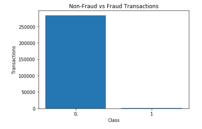
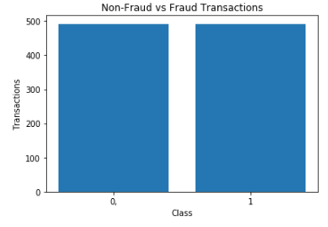
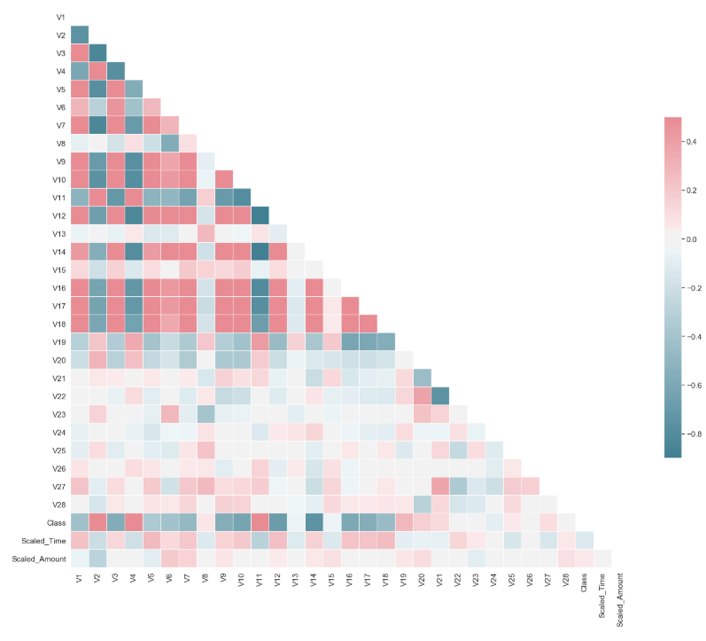
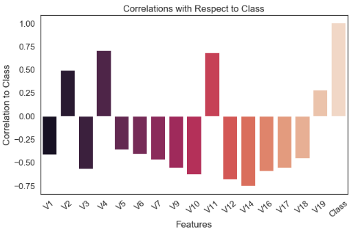
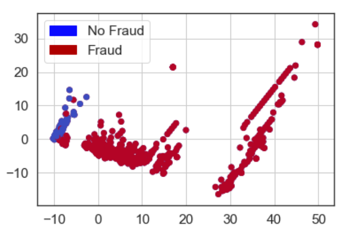
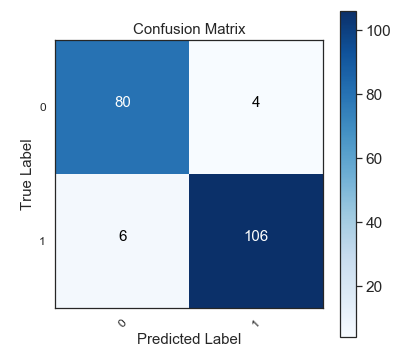
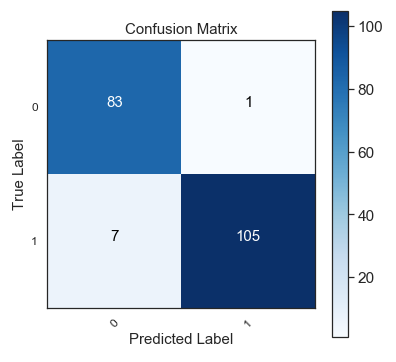
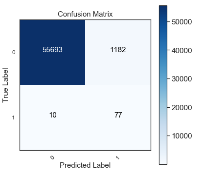
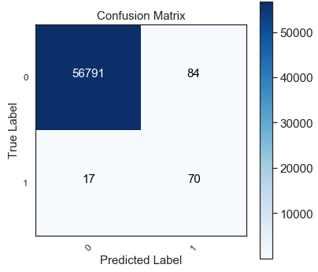

# Credit Card Fraud Detection

One interesting machine learning problem is the detection of fraudulent credit card transactions. A main issue of many of these kinds of problems is due to an imbalanced dataset. In this notebook, I used the credit card transaction dataset from European card holders in 2013 hosted on Kaggle (https://www.kaggle.com/mlg-ulb/creditcardfraud), and have used some of the techniques introduced by other data scientists in tacking such imbalanced datasets. The data set only contains numerical input variables which are a result of a PCA transformation. Due to confidentiality issues, the names of the original features and background information about the data is not shown. 

# Data Exploration
A brief look at the data set indicates that there are more non-fraudulent transactions compared to fraudulent transactions. 

As mentioned before, other features in this dataset are masked due to confidentiality issues. One way to approach an imbalanced dataset is to perform Random Undersampling. This approach randomly selects non-fraud transactions from the dataset to match the total number of fraud transactions in the dataset. After randomly dropping and selecting datapoints, the dataset is balanced but at the cost of potential information loss. 

Using the smaller balanced dataset, I then created a heat map to visually display the correlation between the many masked features. I then used a bar graph to display it clearer with respect to the output variable, class

Once the correlations between the features and the output class is clear, I then used a boxplot to remove extreme outliers of correlated features as these may skew the training of the machine learning models. I then used PCA to see if the datapoints were clustered close together, which would indicate that the non-fraud and fraud transactions would be closer to their own respective groups. 

# Model Implementation
For this problem, I decided to pick a logistic regression model and the K Nearest Neighbour model as they are known to perform well for classification problems. 

### Logistic Regression
Without tuning, the results of the logistic regression using a simple 20% train test split is shown below. 

We can see that the logistic regression does a fairly good job in accurately detecting fraud transactions in the balanced dataset from random undersampling. 

### KNN
Similar to the Logistic Regression results, the K Nearest Neighbours also achieved a similar confusion matrix. 

We can see that both logistic regression and kNN achieved relatively high metrics in classifying fraudulent vs non-fraudulent transactions on the balanced dataset via random undersampling. While these accuracies and scores are already high, we can further improve this through tuning the parameters of the model. However, one main drawback of this dataset is that we undersampled and decreased the original size of the dataset in order to have a balanced dataset between the classes. As a result, we may have information loss from removing data points from our data set. We can further potentially increase our accuracies by using a technique called over sampling, which synthetically creates datapoints to balance our dataset. 

# Synthetic Minority Oversampling Technique (SMOTE)
As mentioned before, we will balance the imbalanced dataset by synthetically producing new data poitns via oversampling. In order to do this, we will need to use the original dataset, resample it via SMOTE - Synthetic Minority Over-sampling Technique, using a library dedicated to dealing with imbalanced datasets. We will then perform the same type of model implementation as was shown in the random undersampling cases. 

It is important to note that the SMOTE over sampling is applied ONLY on the TRAINING SET and NOT on the TEST SET. Modifiying the test set whatsoever (in this case, balancing the output classes) is considered as data leakage and will skew the accuracies and performance of the model.

## Model Results Using SMOTE
### Logistic Regression Using SMOTE

### KNN Using SMOTE

## Comparison of Logistic Regression and KNN using Oversampling
We can see that both Logistic Regression and K Nearest Neighbours achieved relatively high accuracies. However accuracies aren't a good metric to use for imbalanced datasets. Both models largely differ are in the precision and recall scores. Precision is the metric which represents the fractions of relevant instances (true positives) over all the retrieved instances (true+false positives). Recall is the fraction of the total amount of relevant instances that were actually retrieved (true positives / (true positives + false negatives). 

We can see that for logistic regression, it had a lot of false positives (wrongly classifying something as fraud where in fact it was non-fraud. However, logistic regression did perform slightly better for the recall score which means that it was able to detect more of the fraud transactions over the total amount of transactions. On the other hand, kNN achieved a slightly higher precision score (meaning it was able to detect a higher percentage of the fraud cases over the total number of fraud cases), but achieved a lower recall score (meaning it detected more false negatives).  

Additionally, logistic regression had a higher AUC score over kNN. Looking at the confusion matrices for both logistic regression and kNN, kNN was able to classify more of the non-fraud cases correctly. Logistic regression was able to predict more fraud cases correctly but at the cost of misclassifying non-fraud transactions as fraud. 

## Comparison Between Random Undersampling and Oversampling

Comparing the scores of logistic regression and kNN for random undersampling, there doesn't seem to be a large difference between the two model implementations. Noticeably, we can see that the models trained on oversampling achieved higher accuracies but this may be skewed due to the imbalanced nature of the dataset. 

For random undersampling, logistic regression achieved higher metrics than kNN. However, when using the dataset on oversampling, it performs slightly poorly and tends to misclassify non-fraud transactions as fraud transactions. However, logistic regression was able to classify more of the fraud transactions compared to kNN. The results using the oversampled dataset showed a larger difference between the two models as discussed earlier in comparing their results. 

# Conclusion
In the case of detecting credit card fraud transactions, the model to select depends on the company. If the company places a higher priority in determining fraud transacations at the expense of potentially misclassifying non-fraud transactions as fraud, then logistic regression might be better. If the business wants to be able to accurately detect fraud transactions (potentially some fraud transactions will slip) and better detect non-fraud transactions at the same time, then kNN would be better. Other models could also be investigated for this application and hyperparameter tuning can also be used to see if we can increase the precision and recall metrics for both these models. 
